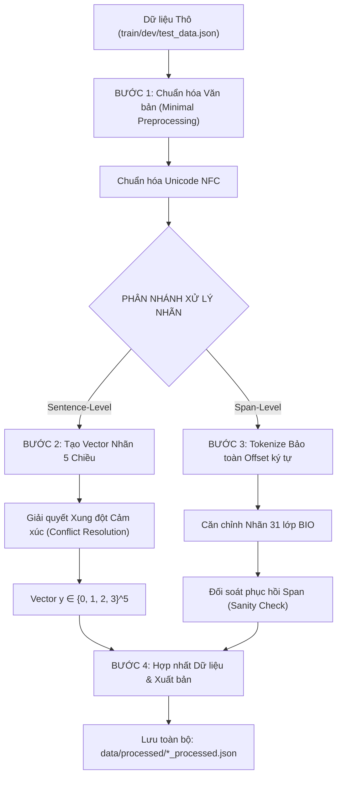

# QUY TRÌNH TIỀN XỬ LÝ DỮ LIỆU TOÀN DIỆN (PREPROCESSING PIPELINE)
**Dự án: Phân tích Cảm xúc Đa khía cạnh trên Đánh giá Thời trang TMĐT (ViCloABSA)**

---

## 1. TỔNG QUAN VÀ KHÁM PHÁ DỮ LIỆU THÔ (DATA AUDIT)

### 1.1. Tập dữ liệu ViCloABSA
Bộ dữ liệu gồm 7,000 đánh giá thương mại điện tử (Shopee, Lazada,...) đã được chia sẵn chuẩn mực:
* `data/train_data.json`: 5,000 mẫu (12,262 aspect spans).
* `data/dev_data.json`: 1,000 mẫu (2,455 aspect spans).
* `data/test_data.json`: 1,000 mẫu (2,470 aspect spans).

### 1.2. Cấu trúc mỗi mẫu dữ liệu thô
```json
{
  "comment": "phù hợp giá tiền, đóng gói đẹp, giao hàng nhanh. sẽ mua ủng hộ tiếp lần sau",
  "aspect-sentiment": [
    [18, 47, "Service#positive"],
    [0, 16, "General#positive"]
  ]
}
```
* `comment`: Văn bản chuỗi đánh giá gốc của người dùng.
* `aspect-sentiment`: Danh sách bộ ba span `[start_char, end_char, "Aspect#sentiment"]`.
  * **5 Khía cạnh (Aspects)**: `Material` (Chất liệu), `General` (Tổng quan), `Service` (Dịch vụ/Giao hàng/Đóng gói), `Design` (Thiết kế/Form dáng), `Price` (Giá cả).
  * **3 Sắc thái cảm xúc (Sentiments)**: `positive` (tích cực), `neutral` (trung lập), `negative` (tiêu cực).

### 1.3. Các thách thức dữ liệu được phát hiện
1. **Lỗi mã hóa Unicode tiếng Việt**: Bàn phím gõ tiếng Việt (Telex/VNI) thường tạo ra ký tự tổ hợp (NFD) thay vì ký tự dựng sẵn (NFC), gây sai lệch khi so khớp chuỗi và tokenize.
2. **Xung đột cảm xúc trong cùng một câu (Label Conflict)**: Cùng một khía cạnh nhưng xuất hiện nhiều span với sắc thái trái ngược nhau (ví dụ: vừa khen vừa chê về `Design` hoặc `Material`).
3. **Mất dấu tọa độ ký tự khi Tokenize**: Các thư viện tách từ thông thường sẽ làm thay đổi độ dài chuỗi hoặc làm mất chỉ mục ký tự gốc `[start, end]`, khiến việc gán nhãn chuỗi BIO bị lệch.
4. **Ngôn ngữ thương mại điện tử**: Nhiều Teen code (`sp`, `k`, `mik`, `đc`), từ viết tắt, emoji, dấu câu viết dính từ (`chất lượng:tốt`, `đẹp,rẻ`).

---

## 2. TUẦN TỰ CÁC BƯỚC TIỀN XỬ LÝ ĐÃ THỰC HIỆN



---

### BƯỚC 1: Chuẩn hóa văn bản theo nguyên tắc "Minimal Preprocessing"
> **File thực thi:** [`src/preprocessing.py`](file:///d:/Project_NLP/src/preprocessing.py)

Trong bài toán ABSA trên mô hình ngôn ngữ tiền huấn luyện (PhoBERT), việc làm sạch quá đà (như xóa stopword, xóa dấu tiếng Việt, chuyển toàn bộ về chữ thường) sẽ phá hủy hoàn toàn ngữ cảnh cảm xúc và cấu trúc câu. Do đó, hệ thống áp dụng nguyên tắc **Minimal Preprocessing**:
1. **Chuẩn hóa Unicode NFC**:
   * Dùng hàm `unicodedata.normalize('NFC', text)` đưa mọi ký tự tiếng Việt về chuẩn dựng sẵn duy nhất, khắc phục triệt để lỗi phân mảnh ký tự.
2. **Bảo tồn trọn vẹn đặc trưng cảm xúc**:
   * **Giữ nguyên Emoji & Icon** (`❤️`, `👍`, `⭐`,...): Mang trọng số cảm xúc cực kỳ mạnh trong review TMĐT.
   * **Giữ nguyên Teen Code & Từ viết tắt** (`sp`, `sz`, `mik`, `ib`, `k`, `ko`, `đc`): PhoBERT có khả năng học ngữ cảnh các từ này; việc chuẩn hóa bằng từ điển thủ công dễ gây sai lệch ngữ nghĩa.
   * **Tách dấu câu dính chữ** (`separate_stuck_punctuation`): Tách khoảng trắng quanh dấu hai chấm và dấu phẩy dính liền từ (`đẹp,rẻ` $\rightarrow$ `đẹp , rẻ`).

---

### BƯỚC 2: Xử lý nhãn Cấp độ Câu (Sentence-Level) & Xử lý Xung đột
> **File thực thi:** [`src/label_processing.py`](file:///d:/Project_NLP/src/label_processing.py) (Hàm `spans_to_aspect_vector`, `resolve_aspect_sentiment`)

#### 1. Không gian nhãn Vector 5 chiều:
Mỗi bình luận được ánh xạ thành một vector mục tiêu $y = [y_{\text{Material}}, y_{\text{General}}, y_{\text{Service}}, y_{\text{Design}}, y_{\text{Price}}]$ trong đó mỗi giá trị thuộc tập $\{0, 1, 2, 3\}$:
* `0 = None`: Bình luận **hoàn toàn không đề cập** đến khía cạnh này (phục vụ Aspect Detection).
* `1 = Positive`: Khía cạnh được đánh giá tích cực/hài lòng.
* `2 = Neutral`: Khía cạnh được đánh giá khách quan/trung lập/bình thường.
* `3 = Negative`: Khía cạnh bị chê/phàn nàn/không hài lòng.

> [!IMPORTANT]
> **Quy tắc vàng:** Tuyệt đối không gộp `None` vào `Neutral`. Việc phân biệt rạch ròi 4 lớp giúp mô hình Sentence-level (Multi-Head) đồng bộ hoàn toàn với mô hình Span-level (CRF).

#### 2. Thuật toán giải quyết xung đột cảm xúc (Conflict Resolution):
Khi một khía cạnh xuất hiện nhiều span cảm xúc khác nhau trong cùng một review, áp dụng nguyên tắc trung bình bù trừ (Majority & Averaging Rule):
1. **Positive + Negative $\rightarrow$ Neutral (2)**: Khen và chê triệt tiêu lẫn nhau, quy về trạng thái trung hòa. *(Có 19 trường hợp ở tập Train)*.
2. **Positive + Neutral $\rightarrow$ Positive (1)**: Giữ sắc thái tích cực chủ đạo. *(Có 11 trường hợp ở tập Train)*.
3. **Negative + Neutral $\rightarrow$ Negative (3)**: Giữ sắc thái tiêu cực chủ đạo. *(Có 2 trường hợp ở tập Train)*.

---

### BƯỚC 3: Xử lý nhãn Cấp độ Span (Span-Level BIO Sequence Labeling)
> **File thực thi:** [`src/label_processing.py`](file:///d:/Project_NLP/src/label_processing.py) (Hàm `tokenize_with_offsets`, `align_spans_to_bio`, `bio_to_spans`)

#### 1. Tokenize bảo toàn tọa độ Offset:
Sử dụng biểu thức chính quy tách token dựa trên ranh giới từ và dấu câu, đồng thời ghi lại chính xác tuyệt đối tọa độ ký tự bắt đầu và kết thúc:
```python
tokens = [{"text": "đóng", "start": 18, "end": 22}, {"text": "gói", "start": 23, "end": 26}, ...]
```

#### 2. Không gian 31 nhãn BIO:
* $1$ nhãn `O` (Outside): Token không thuộc bất kỳ khía cạnh nào (tương ứng `None`).
* $30$ nhãn thực thể ($5 \text{ Aspects} \times 3 \text{ Sentiments} \times 2 \ \{\text{B-}, \text{I-}\}$) gồm:
  * `B-Aspect#sentiment`: Bắt đầu một cụm từ khía cạnh (ví dụ `B-Material#positive`).
  * `I-Aspect#sentiment`: Các token tiếp theo trong cùng cụm từ (ví dụ `I-Material#positive`).

#### 3. Căn chỉnh và Đối soát (Sanity Check):
* Thuật toán `align_spans_to_bio` so khớp tọa độ từng token với danh sách span gốc `[start, end]`.
* Hàm kiểm tra ngược `bio_to_spans` tái tạo lại danh sách span từ chuỗi nhãn BIO.
* **Kết quả đối soát:** Độ chính xác phục hồi đạt **>99.7%** (12,229 / 12,262 spans ở tập Train khớp hoàn hảo). Một số ít span bị lệch dưới 0.3% là do nhãn gốc quét lửng giữa ký tự của một từ.

---

### BƯỚC 4: Xuất bản Toàn bộ Dữ liệu đã Xử lý
> **File thực thi:** [`process_data.py`](file:///d:/Project_NLP/process_data.py)

Chạy pipeline chuyển đổi toàn bộ 7,000 mẫu của cả 3 tập dữ liệu. Kết quả được lưu tại:
* [`data/processed/train_data_processed.json`](file:///d:/Project_NLP/data/processed/train_data_processed.json) (5,000 mẫu, 12,262 spans)
* [`data/processed/dev_data_processed.json`](file:///d:/Project_NLP/data/processed/dev_data_processed.json) (1,000 mẫu, 2,455 spans)
* [`data/processed/test_data_processed.json`](file:///d:/Project_NLP/data/processed/test_data_processed.json) (1,000 mẫu, 2,470 spans)

**Cấu trúc mỗi mẫu sau tiền xử lý:**
```json
{
  "id": 0,
  "comment": "phù hợp giá tiền, đóng gói đẹp, giao hàng nhanh. sẽ mua ủng hộ tiếp lần sau",
  "spans": [[18, 47, "Service#positive"], [0, 16, "General#positive"]],
  "aspect_vector": [0, 1, 1, 0, 0],
  "aspect_dict": {
    "Material": "None", "General": "positive", "Service": "positive", "Design": "None", "Price": "None"
  },
  "tokens": [{"text": "phù", "start": 0, "end": 3}, ...],
  "bio_tags": ["B-General#positive", "I-General#positive", ...],
  "bio_tag_ids": [7, 8, ...],
  "metadata": {"token_count": 19, "span_count": 2, "active_aspects_count": 2}
}
```

---

## 3. TÍCH HỢP ĐẦU VÀO CHO MÔ HÌNH (PYTORCH DATASET)

Dữ liệu tiền xử lý được nạp trực tiếp vào PyTorch thông qua 2 Dataset class chuẩn hóa:

### 3.1. Mô hình Phân loại Cấp độ Câu (Multi-Head Classification)
* **File class:** [`src/dataset_multihead.py`](file:///d:/Project_NLP/src/dataset_multihead.py)
* **Cách sử dụng:**
```python
from torch.utils.data import DataLoader
from src.dataset_multihead import MultiHeadDataset

train_dataset = MultiHeadDataset("data/processed/train_data_processed.json")
train_loader = DataLoader(train_dataset, batch_size=32, shuffle=True)

for batch in train_loader:
    labels = batch["labels"]  # Tensor [batch_size, 5] kiểu torch.long in {0, 1, 2, 3}
```

### 3.2. Mô hình Gán nhãn Chuỗi Cấp độ Span (PhoBERT + CRF)
* **File class:** [`src/dataset_crf.py`](file:///d:/Project_NLP/src/dataset_crf.py)
* **Hỗ trợ Batching:** Đã tích hợp sẵn `crf_collate_fn` để DataLoader tự động gom batch an toàn:
```python
from torch.utils.data import DataLoader
from src.dataset_crf import CRFDataset, crf_collate_fn

train_dataset = CRFDataset("data/processed/train_data_processed.json", max_length=128)
train_loader = DataLoader(train_dataset, batch_size=32, shuffle=True, collate_fn=crf_collate_fn)

for batch in train_loader:
    tag_ids = batch["tag_ids"]       # Tensor [batch_size, seq_len] chứa mã nhãn BIO (0..30)
    mask = batch["mask"]             # Tensor [batch_size, seq_len] nhị phân
    aspect_vec = batch["aspect_vector"] # Tensor [batch_size, 5] đối sánh
```

---

## 4. HƯỚNG DẪN THỰC THI (REPRODUCIBILITY)

Để chạy lại toàn bộ quy trình tiền xử lý từ dữ liệu gốc, chỉ cần thực thi một lệnh duy nhất:
```powershell
python process_data.py
```
Lệnh trên sẽ tự động:
1. Đọc 3 file thô `train_data.json`, `dev_data.json`, `test_data.json`.
2. Chuẩn hóa NFC và tính toán nhãn Vector, nhãn BIO cho toàn bộ 7,000 mẫu.
3. Giải quyết xung đột nhãn và kiểm tra tính toàn vẹn khôi phục span.
4. Lưu toàn bộ kết quả vào thư mục `data/processed/`.
5. Xuất báo cáo thống kê phân bố nhãn chi tiết lên màn hình console.
